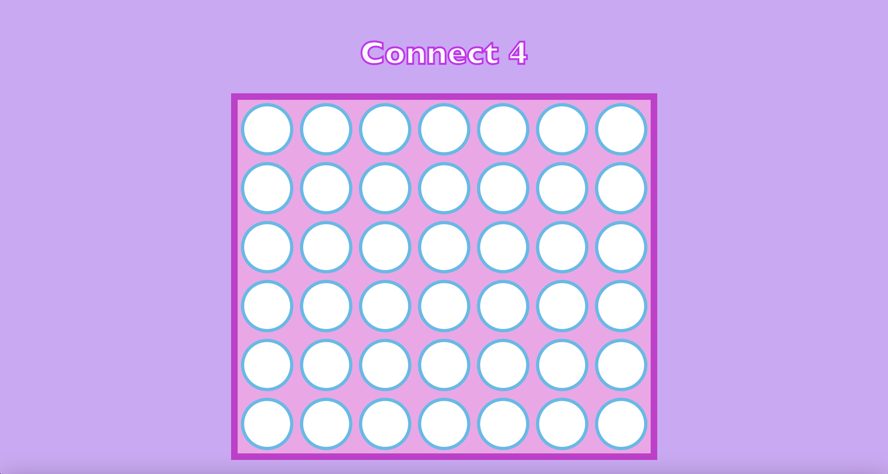
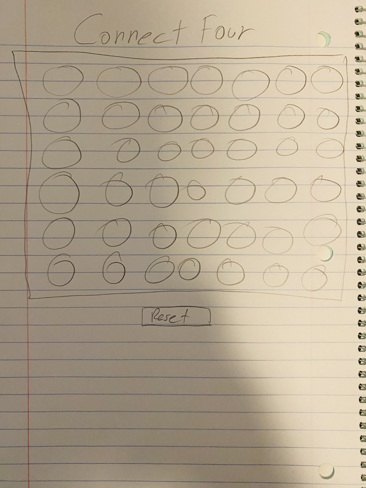

# Connect Four 

languages used: HTML, CSS, Javascript
## Background

Game link:
https://ris001.github.io
image of game: 


## Wireframe
image of wireframe:

### PseudoCode

6x7
red and yellow coins 
**need to make it so tnhat if a row is clicked on the coin goes to the bottom of tbe row. 

```js

let playerR = 'Red'
let playerY = 'Yellow'
let currentPlayer = playerR
let rows = 6
let columns = 7
let current Columns = []
var gameOver = false

window.onload = function() {
    setGame();
}


function setPiece() {
    if gameOver or return
}
    
function checkWinner() {
    check horizontally, vertically and diagonally x2, by checking groups of 4 cells at a time 
    if true run function setWinner
}    


function setWinner{
    announce the winner R or Y
    
}


var gameOver = true
```